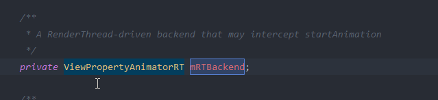
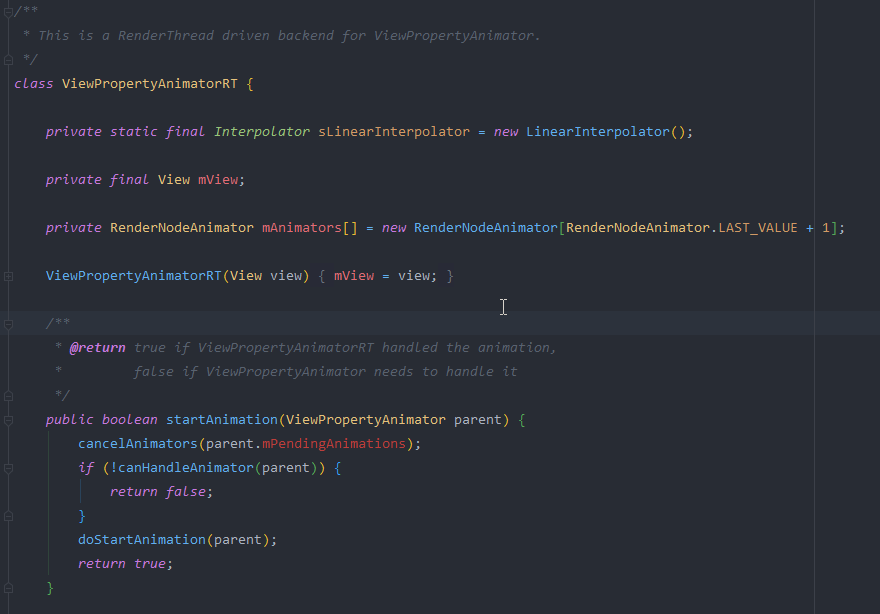
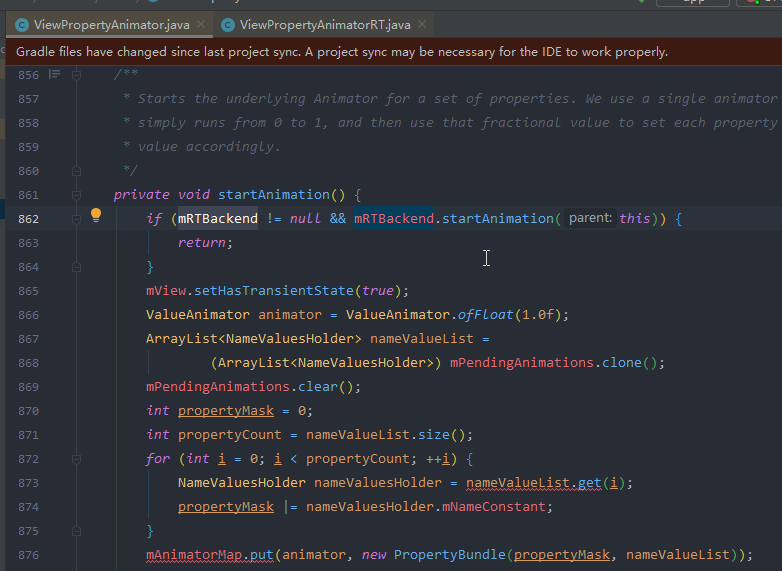
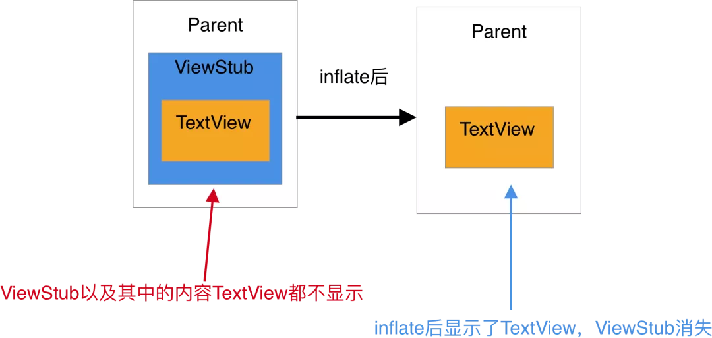
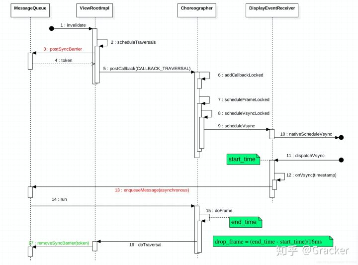

# UI优化
## RelativeLayout和LinearLayout性能分析
* 1.RelativeLayout会让子View调用2次onMeasure，LinearLayout 在有weight时，也会调用子View2次onMeasure
* 2.RelativeLayout的子View如果高度和RelativeLayout不同，则会引发效率问题，当子View很复杂时，这个问题会更加严重。如果可以，尽量使用padding代替margin。

## RenderThread
* 5.1引入了renderthread线程，可以讲draw操作从UIThread解放出来，这样做的好处是，UIThread将绘制指令sync给renderthread以后可以继续执行measure/layout操作，非常有利于提升设备操作体验

* 用RenderThread执行动画,使用条件
	* 支持硬件加速
    * 不设置任何动画回调
    * ViewPropertyAnimatorRT 不为null，需要反射

## ViewStub
* ViewStub 是一个看不见的，没有大小，不占布局位置的 View，可以用来懒加载布局。onMessage设置为0，setMeasuredDimension(0, 0);
* 当 ViewStub 变得可见或 inflate() 的时候，布局就会被加载（替换 ViewStub）。因此，ViewStub 一直存在于视图层次结构中直到调用了 setVisibility(int) 或 inflate()。ViewStub只能用来Inflate一个布局文件，而不是某个具体的View，当然也可以把View写在某个布局文件中。
* 在 ViewStub 加载完成后就会被移除，它所占用的空间就会被新的布局替换。否则会报错：ViewStub must have a non-null ViewGroup viewParent。

* ViewStub为何不绘制，setWillNotDraw中设置flag,setFlags(willNotDraw ? WILL_NOT_DRAW : 0, DRAW_MASK);设置WILL_NOT_DRAW之后，onDraw()不会被调用，通过略过绘制的过程，优化了性能。
* 不能引入包含merge标签的布局到ViewStub中。否则会报错：android.view.InflateException: Binary XML file line #1:  can be used only with a valid ViewGroup root and attachToRoot=true

## RenderScript
## 异常，系统Bug
### Toast异常处理

## 调试
* 查询当前屏幕界面所在(对应)的Activity
* inspect 当前正在调试的前台APP的UI层级和信息
* dump当前屏幕界面的UI树层级信息(pull之后打开对应的xml即可查看)
* 属性动画，可以在开发者选项中调整大小和时长缩放，比如加大时长缩放值，则可以以类似慢镜头的方式查看动画效果

### FPS检测
帧率检测是UI卡顿检测的一环，可通过Choreographer监听实现，android/view/Choreographer.java

	public void onVsync(long timestampNanos, long physicalDisplayId, int frame) {
	    ......
	    mTimestampNanos = timestampNanos;
	    mFrame = frame;
	    Message msg = Message.obtain(mHandler, this);
	    msg.setAsynchronous(true);
	    mHandler.sendMessageAtTime(msg, timestampNanos / TimeUtils.NANOS_PER_MS);
	}
	public void run() {
	    mHavePendingVsync = false;
	    doFrame(mTimestampNanos, mFrame);
	}

doFrame 函数主要做下面几件事

* 计算掉帧逻辑
* 记录帧绘制信息
* 执行 CALLBACK_INPUT、CALLBACK_ANIMATION、CALLBACK_INSETS_ANIMATION、CALLBACK_TRAVERSAL、CALLBACK_COMMIT

	void doFrame(long frameTimeNanos, int frame) {
	    final long startNanos;
	    synchronized (mLock) {
	        ......
	        long intendedFrameTimeNanos = frameTimeNanos;
	        startNanos = System.nanoTime();
	        final long jitterNanos = startNanos - frameTimeNanos;
	        if (jitterNanos >= mFrameIntervalNanos) {
	            final long skippedFrames = jitterNanos / mFrameIntervalNanos;
	            if (skippedFrames >= SKIPPED_FRAME_WARNING_LIMIT) {
	                Log.i(TAG, "Skipped " + skippedFrames + " frames!  "
	                        + "The application may be doing too much work on its main thread.");
	            }
	        }
	        ......
	    }
	    ......
	}

由于 Choreographer 的位置，许多性能监控的手段都是利用 Choreographer 来做的，除了自带的掉帧计算，Choreographer 提供的 FrameCallback 和 FrameInfo 都给 App 暴露了接口，让 App 开发者可以通过这些方法监控自身 App 的性能，其中常用的方法如下：

* 利用 FrameCallback 的 doFrame 回调
* 利用 FrameInfo 进行监控
 使用 ：adb shell dumpsys gfxinfo framestats
 示例 ：adb shell dumpsys gfxinfo com.meizu.flyme.launcher framestats
* 利用 SurfaceFlinger 进行监控
 使用 ：adb shell dumpsys SurfaceFlinger --latency
 示例 ：adb shell dumpsys SurfaceFlinger --latency com.meizu.flyme.launcher/com.meizu.flyme.launcher.Launcher#0
* 利用 SurfaceFlinger PageFlip 机制进行监控
 使用 ： adb service call SurfaceFlinger 1013
 备注：需要系统权限
* Choreographer 自身的掉帧计算逻辑
* BlockCanary 基于 Looper 的性能监控

### Blockcanary 
Blockcanary 计算做性能监控使用的是 Looper 的消息机制，通过对 MessageQueue 中每一个 Message 的前后进行记录，打到监控性能的目的

	public static void loop() {
	    ...
	    for (;;) {
	        ...
	        // This must be in a local variable, in case a UI event sets the logger
	        Printer logging = me.mLogging;
	        if (logging != null) {
	            logging.println(">>>>> Dispatching to " + msg.target + " " +
	                    msg.callback + ": " + msg.what);
	        }
	        msg.target.dispatchMessage(msg);
	        if (logging != null) {
	            logging.println("<<<<< Finished to " + msg.target + " " + msg.callback);
	        }
	        ...
	    }
	}

创建自定义的Printer设置给Looper

	Looper.getMainLooper().setMessageLogging(mainLooperPrinter);
	//Printer
	public void println(String x) {
	    if (!mStartedPrinting) {
	        mStartTimeMillis = System.currentTimeMillis();
	        mStartThreadTimeMillis = SystemClock.currentThreadTimeMillis();
	        mStartedPrinting = true;
	    } else {
	        final long endTime = System.currentTimeMillis();
	        mStartedPrinting = false;
	        if (isBlock(endTime)) {
	            notifyBlockEvent(endTime);
	        }
	    }
	}
	
	private boolean isBlock(long endTime) {
	    return endTime - mStartTimeMillis > mBlockThresholdMillis;
	}