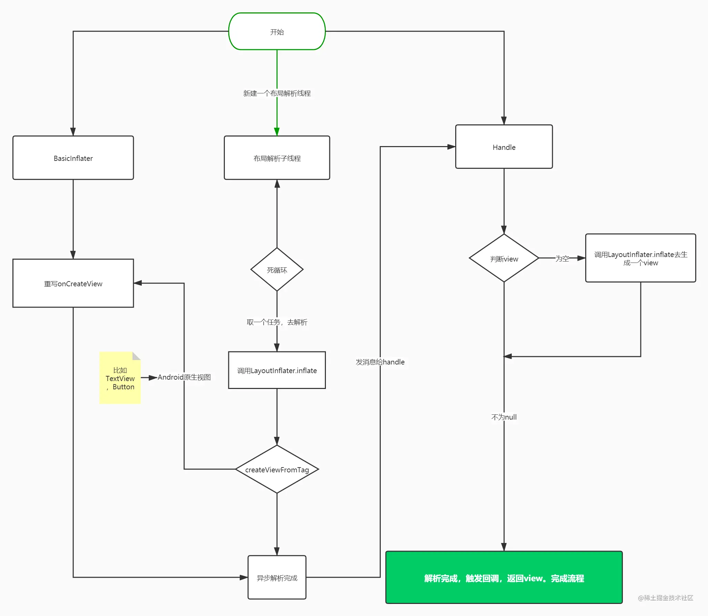
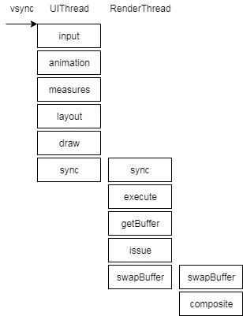

# UI优化
Android框架下的UI加载主要分为布局加载（xml）和View加载。
UI加载耗时的主要原因有二：
* xml文件读取是I/O操作
* 解析xml文件获取类名、属性，反射调用View的两个参数的构造函数

常规优化方案包括：
* 减少布局嵌套层数，减少过度绘制
* 空页面、错误页面等进行懒加载

## 规避xml加载
## 优化xml反射创建view,Factory2
通过LayoutInflater.setFactory，我们不仅能够控制View的生成，甚至可以把一个View变成另一个View。

## 渐进式加载
简单来说，渐进式加载就是一部分一部分加载，当前帧加载完成之后，再去加载下一帧。

一种极致的做法是，加载 xml 文件，就像加载一个空白的 xml，布局全部使用 ViewStub 标签进行懒加载。
上述伪代码这种写法是ok的，但是这种做法，有一个很明显的缺点，就是会造成回调地狱。

## 异步加载AsyncLayoutInflater

* 使用异步 inflate，那么需要这个 layout 的 parent 的 generateLayoutParams 函数是线程安全的——generateLayoutParams 方法通常是直接创建一个对象，因而非线程安全情况下创建多次而使用非同一个对象的情况。
* 所有构建的 View 中必须不能创建 Handler 或者是调用 Looper.myLooper——因为是在异步线程中加载的，异步线程默认没有调用 Looper.prepare()
* 异步转换出来的 View 并没有被加到 parent view中，AsyncLayoutInflater 是调用了 LayoutInflater.inflate(int, ViewGroup, false)，因此如果需要加到 parent view 中，就需要我们自己手动调用addView；
* AsyncLayoutInflater 不支持设置 LayoutInflater.Factory 或者 LayoutInflater.Factory2
不支持加载包含 Fragment 的 layout；
* 如果 AsyncLayoutInflater 失败，那么会自动回退到UI线程来加载布局；

## RelativeLayout和LinearLayout性能分析
* 1.RelativeLayout会让子View调用2次onMeasure，LinearLayout 在有weight时，也会调用子View2次onMeasure
* 2.RelativeLayout的子View如果高度和RelativeLayout不同，则会引发效率问题，当子View很复杂时，这个问题会更加严重。如果可以，尽量使用padding代替margin。

## ShapeDrawable和BitmpaDrawable

| 方案 | 原理 | 特点 |
|  ----  | ----  |
|使用PNG图片（BitmapDrawable）| 解码PNG图片生成Bitmap，传到底层，由GPU渲染| 图片解码消耗CPU运算资源， Bitmap占用内存大，绘制慢
|使用XML或Java代码实现（ShapeDrawable）|直接将Shape信息传到底层，由GPU渲染|消耗CPU资源少，占用内存小，绘制快

## ViewStub
* ViewStub 是一个看不见的，没有大小，不占布局位置的 View，可以用来懒加载布局。onMessage设置为0，setMeasuredDimension(0, 0);
* 当 ViewStub 变得可见或 inflate() 的时候，布局就会被加载（替换 ViewStub）。因此，ViewStub 一直存在于视图层次结构中直到调用了 setVisibility(int) 或 inflate()。ViewStub只能用来Inflate一个布局文件，而不是某个具体的View，当然也可以把View写在某个布局文件中。
* 在 ViewStub 加载完成后就会被移除，它所占用的空间就会被新的布局替换。否则会报错：ViewStub must have a non-null ViewGroup viewParent。

* ViewStub为何不绘制，setWillNotDraw中设置flag,setFlags(willNotDraw ? WILL_NOT_DRAW : 0, DRAW_MASK);设置WILL_NOT_DRAW之后，onDraw()不会被调用，通过略过绘制的过程，优化了性能。
* 不能引入包含merge标签的布局到ViewStub中。否则会报错：android.view.InflateException: Binary XML file line #1:  can be used only with a valid ViewGroup root and attachToRoot=true

## RenderThread
* 5.1引入了renderthread线程，可以讲draw操作从UIThread解放出来，这样做的好处是，UIThread将绘制指令sync给renderthread以后可以继续执行measure/layout操作，非常有利于提升设备操作体验

* 用RenderThread执行动画,使用条件
	* 支持硬件加速
    * 不设置任何动画回调
    * ViewPropertyAnimatorRT 不为null，需要反射

## RenderScript
## 异常，系统Bug
### Toast异常处理
#### BadTokenException
我们知道在Android上，任何视图的显示都要依赖于一个视图窗口Window，同样Toast的显示也需要一个窗口，前文已经分析了这个窗口的类型就是TYPE_TOAST，是一个系统窗口，这个窗口最终会被WindowManagerService(WMS)标记管理。但是我们的普通应用程序怎么能拥有添加系统窗口的权限呢？查看源码后发现需要以下几个步骤：

* 当显示一个Toast时，NMS会生成一个token，而NMS本身就是一个系统级的服务，所以由它生成的token必然拥有权限添加系统窗口。
* NMS通过ITransientNotification也就是tn对象，将生成的token回传到我们自己的应用程序进程中。
* 应用程序调用handleShow方法，去向WindowManager添加窗口。
* WindowManager检查当前窗口的token是否有效，如果有效，则添加窗口展示Toast；如果无效，则抛出上述异常，Crash发生。

token的衍生，Toast被windowmanager添加的的类型是TYPE_TOAST,我们使用windowmanager.addView时，token会默认生成一个

	public void setDefaultToken(IBinder token) {
	        mDefaultToken = token;
	    }
	
	    @Override
	    public void addView(@NonNull View view, @NonNull ViewGroup.LayoutParams params) {
	        applyDefaultToken(params);
	        mGlobal.addView(view, params, mContext.getDisplay(), mParentWindow);
	    }
	
	    @Override
	    public void updateViewLayout(@NonNull View view, @NonNull ViewGroup.LayoutParams params) {
	        applyDefaultToken(params);
	        mGlobal.updateViewLayout(view, params);
	    }
	
	    private void applyDefaultToken(@NonNull ViewGroup.LayoutParams params) {
	        // Only use the default token if we don't have a parent window.
	        if (mDefaultToken != null && mParentWindow == null) {
	            if (!(params instanceof WindowManager.LayoutParams)) {
	                throw new IllegalArgumentException("Params must be WindowManager.LayoutParams");
	            }
	
	            // Only use the default token if we don't already have a token.
	            final WindowManager.LayoutParams wparams = (WindowManager.LayoutParams) params;
	            if (wparams.token == null) {
	                wparams.token = mDefaultToken;
	            }
	        }
	    }
## 调试
* 查询当前屏幕界面所在(对应)的Activity
* inspect 当前正在调试的前台APP的UI层级和信息
* dump当前屏幕界面的UI树层级信息(pull之后打开对应的xml即可查看)
* 属性动画，可以在开发者选项中调整大小和时长缩放，比如加大时长缩放值，则可以以类似慢镜头的方式查看动画效果

### FPS检测
帧率检测是UI卡顿检测的一环，可通过Choreographer监听实现，android/view/Choreographer.java

	public void onVsync(long timestampNanos, long physicalDisplayId, int frame) {
	    ......
	    mTimestampNanos = timestampNanos;
	    mFrame = frame;
	    Message msg = Message.obtain(mHandler, this);
	    msg.setAsynchronous(true);
	    mHandler.sendMessageAtTime(msg, timestampNanos / TimeUtils.NANOS_PER_MS);
	}
	public void run() {
	    mHavePendingVsync = false;
	    doFrame(mTimestampNanos, mFrame);
	}

doFrame 函数主要做下面几件事

* 计算掉帧逻辑
* 记录帧绘制信息
* 执行 CALLBACK_INPUT、CALLBACK_ANIMATION、CALLBACK_INSETS_ANIMATION、CALLBACK_TRAVERSAL、CALLBACK_COMMIT

	void doFrame(long frameTimeNanos, int frame) {
	    final long startNanos;
	    synchronized (mLock) {
	        ......
	        long intendedFrameTimeNanos = frameTimeNanos;
	        startNanos = System.nanoTime();
	        final long jitterNanos = startNanos - frameTimeNanos;
	        if (jitterNanos >= mFrameIntervalNanos) {
	            final long skippedFrames = jitterNanos / mFrameIntervalNanos;
	            if (skippedFrames >= SKIPPED_FRAME_WARNING_LIMIT) {
	                Log.i(TAG, "Skipped " + skippedFrames + " frames!  "
	                        + "The application may be doing too much work on its main thread.");
	            }
	        }
	        ......
	    }
	    ......
	}

由于 Choreographer 的位置，许多性能监控的手段都是利用 Choreographer 来做的，除了自带的掉帧计算，Choreographer 提供的 FrameCallback 和 FrameInfo 都给 App 暴露了接口，让 App 开发者可以通过这些方法监控自身 App 的性能，其中常用的方法如下：

* 利用 FrameCallback 的 doFrame 回调
* 利用 FrameInfo 进行监控
 使用 ：adb shell dumpsys gfxinfo framestats
 示例 ：adb shell dumpsys gfxinfo com.meizu.flyme.launcher framestats
* 利用 SurfaceFlinger 进行监控
 使用 ：adb shell dumpsys SurfaceFlinger --latency
 示例 ：adb shell dumpsys SurfaceFlinger --latency com.meizu.flyme.launcher/com.meizu.flyme.launcher.Launcher#0
* 利用 SurfaceFlinger PageFlip 机制进行监控
 使用 ： adb service call SurfaceFlinger 1013
 备注：需要系统权限
* Choreographer 自身的掉帧计算逻辑
* BlockCanary 基于 Looper 的性能监控

### Blockcanary 
Blockcanary 计算做性能监控使用的是 Looper 的消息机制，通过对 MessageQueue 中每一个 Message 的前后进行记录，打到监控性能的目的

	public static void loop() {
	    ...
	    for (;;) {
	        ...
	        // This must be in a local variable, in case a UI event sets the logger
	        Printer logging = me.mLogging;
	        if (logging != null) {
	            logging.println(">>>>> Dispatching to " + msg.target + " " +
	                    msg.callback + ": " + msg.what);
	        }
	        msg.target.dispatchMessage(msg);
	        if (logging != null) {
	            logging.println("<<<<< Finished to " + msg.target + " " + msg.callback);
	        }
	        ...
	    }
	}

创建自定义的Printer设置给Looper

	Looper.getMainLooper().setMessageLogging(mainLooperPrinter);
	//Printer
	public void println(String x) {
	    if (!mStartedPrinting) {
	        mStartTimeMillis = System.currentTimeMillis();
	        mStartThreadTimeMillis = SystemClock.currentThreadTimeMillis();
	        mStartedPrinting = true;
	    } else {
	        final long endTime = System.currentTimeMillis();
	        mStartedPrinting = false;
	        if (isBlock(endTime)) {
	            notifyBlockEvent(endTime);
	        }
	    }
	}
	
	private boolean isBlock(long endTime) {
	    return endTime - mStartTimeMillis > mBlockThresholdMillis;
	}